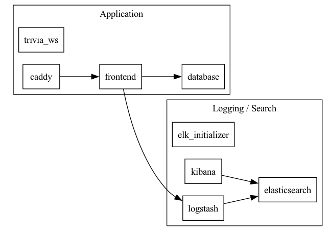
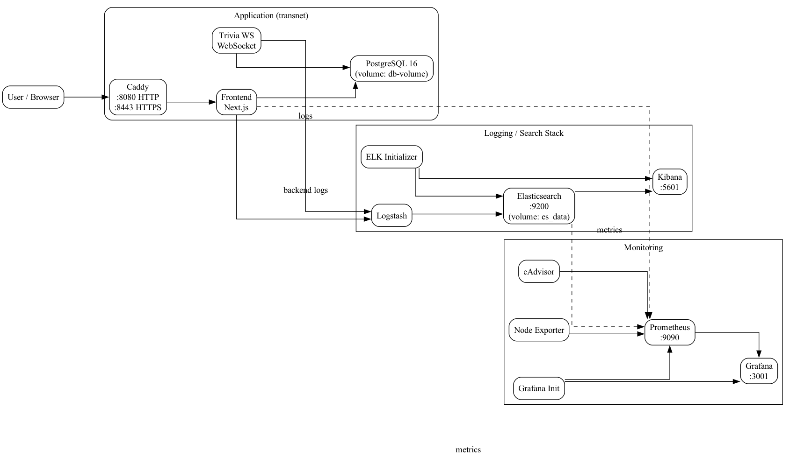
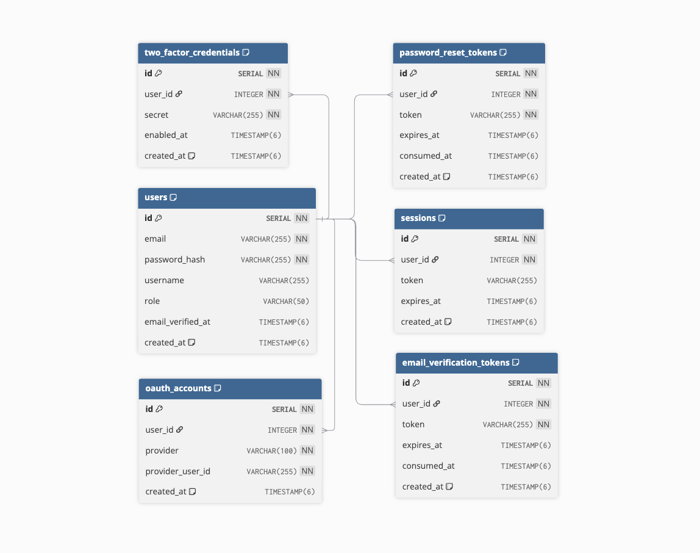
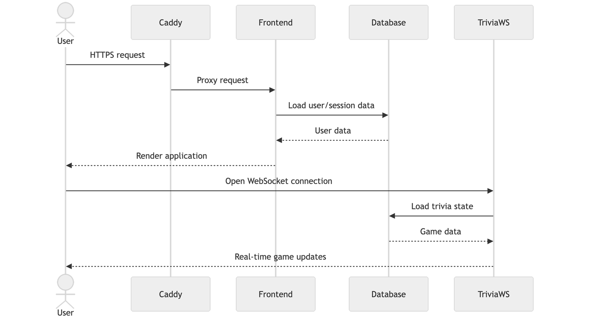

*This project has been created as part of the 42 curriculum by adjeuken, ytsyrend, tchvatal, vnicoles.*

# ft_transcendence - Trivia App

## Description

**ft_transcendence - Trivia App** is a secure, Dockerized, multi-user web application built for the 42 `ft_transcendence` subject. The subject allows teams to choose their own web application idea as long as the project includes a frontend, backend, database, user management, HTTPS, multi-user support, and enough validated modules to reach 14 points.

This implementation is a real-time multiplayer trivia platform. Users can register, log in, manage their profile, join game rooms, play live trivia matches through WebSockets, and use protected admin features when they have the correct role.

Key features:

- Next.js web application with frontend pages and backend API routes.
- PostgreSQL database accessed through Prisma ORM.
- HTTPS reverse proxy with Caddy.
- Email/password authentication with hashed passwords.
- Email verification and password reset flows.
- Google and GitHub OAuth login.
- Two-factor authentication from the authenticated user area.
- Admin user management with role-based access control.
- Real-time trivia rooms through a dedicated WebSocket service.
- Prometheus and Grafana monitoring.
- ELK stack for log collection and visualization.
- Privacy Policy and Terms of Service pages.

<p align="center">
  
</p>

## Subject Requirements Covered

The subject requires the project to be a web application with a frontend, backend, and database. It must run through containerization with a single command, support multiple simultaneous users, use HTTPS for browser/backend connections, validate user input, store secrets in ignored environment files, and provide a complete README.

This repository covers those requirements with:

- **Frontend:** Next.js pages under `nextApp/src/app`.
- **Backend:** Next.js API routes under `nextApp/src/app/api` plus the `trivia-ws` WebSocket service.
- **Database:** PostgreSQL with Prisma schema and relations.
- **Containerization:** `docker-compose.yml` and `Makefile` commands.
- **HTTPS:** Caddy serves the application at `https://localhost:8443`.
- **Multi-user support:** users can log in concurrently and interact with live game rooms.
- **Security:** password hashing, session cookies, role checks, email verification, 2FA, and OAuth.

## Instructions

### Prerequisites

Install these tools before running the project:

- Docker Engine or Docker Desktop.
- Docker Compose v2.
- Make.
- A modern browser, preferably the latest stable Google Chrome for evaluation.

### Environment

The compose setup uses `.env_local`:

```bash
.env_local
```

It must contain the database, admin, mail, OAuth, Grafana, and Elastic credentials required by the services. The subject expects real secrets to stay outside Git. Keep local secrets in `.env_local` or `.env`, and keep example values in an example file.

Important variables include:

```env
POSTGRES_DB=
POSTGRES_USER=
POSTGRES_PASSWORD=
API_KEY=
DATABASE_UR=
ADMIN_EMAIL=
ADMIN_PASSWORD=
SMTP_HOST=
SMTP_PORT=
SMTP_USER=
SMTP_PASS=
MAIL_FROM=
APP_URL=
GOOGLE_CLIENT_ID=
GOOGLE_CLIENT_SECRET=
GITHUB_CLIENT_ID=
GITHUB_CLIENT_SECRET=
COMPOSE_PROJECT_NAME=
ELASTIC_PASSWORD=
KIBANA_PASSWORD=
LOGSTASH_PASSWORD=
ELASTICSEARCH_HOSTS=
ELASTICSEARCH_USERNAME=
ELASTICSEARCH_PASSWORD=
XPACK_ENCRYPTEDSAVEDOBJECTS_ENCRYPTIONKEY=
XPACK_SECURITY_ENCRYPTIONKEY=
XPACK_REPORTING_ENCRYPTIONKEY=
```

### Start The Project

Recommended command:

```bash
docker compose -f ./docker-compose.yml --env-file .env_local up --build -d
```

Or with Make:

```bash
make dev
```

Check running containers:

```bash
docker compose -f ./docker-compose.yml --env-file .env_local ps
```

Follow logs:

```bash
docker compose -f ./docker-compose.yml --env-file .env_local logs -f
```

Stop containers:

```bash
docker compose -f ./docker-compose.yml --env-file .env_local down
```

Remove containers, images, and volumes:

```bash
make fclean
```

Use `make fclean` carefully because it removes persisted database and service volumes.

## Application URLs

| Service | URL | Purpose |
|---|---|---|
| Main app | `https://localhost:8443` | User-facing application |
| Login/Register | `https://localhost:8443/login` | Authentication page |
| Dashboard | `https://localhost:8443/dashboard` | Authenticated landing page |
| Profile | `https://localhost:8443/profile` | Account and 2FA management |
| Game | `https://localhost:8443/game` | Trivia game room UI |
| Admin users | `https://localhost:8443/admin/users` | Admin user management |
| API docs | `https://localhost:8443/swagger` | Swagger documentation |
| Legal pages | `https://localhost:8443/legal` | Privacy Policy and Terms of Service |
| Prometheus | `http://localhost:9090` | Metrics server |
| Prometheus targets | `http://localhost:9090/targets` | Target health |
| Grafana | `http://localhost:3001` | Dashboards and monitoring |
| Kibana | `http://localhost:5601` | Log visualization |
| Elasticsearch | `http://localhost:9200` | Search/log storage API |

## Technical Stack

| Layer | Technology | Why it was chosen |
|---|---|---|
| Frontend | Next.js, React, Bootstrap | Fast page development, reusable UI, integrated routing |
| Backend | Next.js API routes | Same framework can serve frontend and backend behavior |
| Real-time service | Node.js, TypeScript, `ws` | Dedicated WebSocket service for live trivia rooms |
| Database | PostgreSQL | Reliable relational database with clear schema support |
| ORM | Prisma | Typed database access and schema documentation |
| Reverse proxy | Caddy | Local HTTPS and simple routing to services |
| Monitoring | Prometheus, Grafana | Metrics collection and dashboards |
| Logging | Elasticsearch, Logstash, Kibana | Centralized log ingestion, storage, and visualization |
| Mail | Nodemailer / SMTP | Email verification and password reset flows |
| Authentication | Password auth, OAuth, 2FA | Covers base auth and optional user-management modules |

## Services

| Service | Container | Description |
|---|---|---|
| `frontend` | `frontend` | Next.js application and API routes |
| `trivia-ws` | `trivia-ws` | WebSocket trivia room/game server |
| `database` | `database` | PostgreSQL database |
| `caddy` | `caddy` | HTTPS reverse proxy |
| `prometheus` | `prometheus` | Metrics collection |
| `grafana` | `grafana` | Monitoring dashboards |
| `grafana-init` | `grafana-init` | Grafana datasource/dashboard initialization |
| `elasticsearch` | `es` | Log storage and indexing |
| `logstash` | `logstash` | Log processing pipeline |
| `kibana` | `kibana` | Log visualization UI |
| `elk-initializer` | `elk-initializer` | ELK setup helper |

<p align="center">
  
</p>

## Database Schema

The Prisma schema is in:

```bash
nextApp/prisma/schema.prisma
```

Main database entities:

- `users`: application users, email/password credentials, role, protected flag, email verification timestamp.
- `sessions`: authenticated user sessions linked to users.
- `email_verification_tokens`: tokens used to verify newly registered accounts.
- `password_reset_tokens`: tokens used for password reset.
- `two_factor_credentials`: per-user 2FA secrets and enable timestamp.
- `oauth_accounts`: linked external OAuth providers such as Google and GitHub.
- `groups` and `group_members`: group membership data.
- `challenges`, `submissions`, `submission_photos`, `votes`, `daily_stars`: challenge/voting domain tables present in the current schema.

Important relationships:

- One user can have many sessions.
- One user can have many OAuth accounts.
- One user can have one 2FA credential.
- Users can be linked to groups through `group_members`.
- Challenges belong to groups and can reference a winner user.
- Submissions and votes are connected to users and challenges.

<p align="center">
  
</p>

## Feature List

| Feature | Description | Main area | dev person |
|---|---|---|  --- |
| Registration/login | Users can create accounts and log in with email/password | Auth | adjeuken |
| Email verification | Newly registered accounts can be verified by email | Auth/email | adjeuken |
| Password reset | Users can request and complete password reset | Auth/email | adjeuken |
| OAuth login | Google and GitHub login routes are available | Auth/OAuth | adjeuken |
| Two-factor authentication | Users can set up, verify, enable, and disable 2FA | Auth/security | adjeuken |
| Social account 2FA setup | OAuth users are asked to set a password while enabling 2FA | Auth/security | adjeuken, tchvatal |
| Sessions | Authenticated state is stored through server-side session logic and cookies | Auth | ytsyrend, vnicoles |
| Dashboard | Authenticated entry point after login | Frontend | tchvatal, adjeuken |
| Profile | User profile and account security management | Frontend/auth | everyone |
| Admin panel | Admin users can manage users and roles | Admin/RBAC | ytsyrend |
| Protected admin routes | Admin APIs check authentication and role server-side | Backend/security | ytsyrend |
| Trivia game | Users can access game rooms and play live trivia | Game | tchvatal, adjeuken, vnicoles |
| WebSocket rooms | The game uses `trivia-ws` for live room communication | Real-time | vnicoles, tchvatal |
| Metrics endpoint | Application metrics are exposed for Prometheus | DevOps | ytsyrend |
| Grafana dashboards | Grafana is included and secured with admin credentials | DevOps | ytsyrend |
| ELK logging | Elasticsearch, Logstash, and Kibana are included for logs | DevOps | ytsyrend, tchvatal |
| Legal pages | Privacy Policy and Terms of Service are available | Compliance | tchvatal |
| Swagger page | API documentation page is available | Documentation | ytsyrend |

## Chosen Modules

The subject requires 14 points total. The current README claims the following module set.

### Major Modules

| Module | Points | Implementation |
|---|---:|---|
| Use a framework for both frontend and backend | 2 | Next.js is used for React frontend pages and backend API routes. |
| Public API to interact with the database | 2 | API routes under `nextApp/src/app/api`, with Swagger documentation page. Confirm final API-key/rate-limit behavior before evaluation. |
| Advanced permissions system | 2 | User roles, admin-only UI, admin user management, and backend role checks. |
| Infrastructure for log management using ELK | 2 | Elasticsearch, Logstash, Kibana, and initialization services are in Docker Compose. |
| Real-time features using WebSockets | 2 | `trivia-ws` service handles real-time game room messages. |
| Complete web-based game | 2 | Real-time trivia game with rooms and scoring/game flow. |
| Multiplayer game with more than two players | 2 | Trivia rooms are designed for multi-player participation. |

Major total: **14 points**.

### Minor Modules

| Module | Points | Implementation |
|---|---:|---|
| Use an ORM for the database | 1 | Prisma models and generated client for PostgreSQL. |
| Complete 2FA system | 1 | 2FA setup, verify, enable, disable, and login challenge flow. |
| Support for additional browsers | 1 | UI uses standard web technologies; final browser testing should be documented. |
| Remote authentication with OAuth 2.0 | 1 | Google and GitHub OAuth start/callback routes. |
| Monitoring with Prometheus and Grafana | 2 | Prometheus service, app metrics endpoint, Grafana service, and initialization. |

Minor/extra total currently listed: **6 points**.

Evaluation note: only claim modules that the team can demonstrate fully. If API key/rate limiting, additional-browser testing, or Grafana alerting/dashboards are incomplete, mark those as partial or remove them from the claimed list before submission.

## Game Flow

1. A user logs in or registers.
2. The user reaches the dashboard.
3. The user opens the game page.
4. The frontend connects to the `trivia-ws` service through Caddy using the `/ws` route.
5. Players join or create rooms.
6. The room runs trivia questions from packs in `trivia-ws/trivia_packs`.
7. The WebSocket service broadcasts state updates to connected clients.
8. Players answer questions and the game determines progress/results according to the room logic.

Question packs currently include:

- `geography.json`
- `history.json`
- `science.json`

<p align="center">
  
</p>

## Security Notes

Security behavior expected by the subject and implemented or represented in this project:

- Passwords are hashed before storage.
- Authentication state is checked server-side for protected routes.
- Admin APIs must verify the current user and role, not only hide buttons in the frontend.
- Deleted or missing users must not keep usable sessions.
- OAuth users can be required to set a password before enabling 2FA.
- Secrets belong in local env files, not committed files.
- Browser-to-backend traffic goes through HTTPS via Caddy.
- User inputs should be validated in frontend and backend.

Before evaluation, verify:

```bash
git status --short
```

Make sure no real secrets are staged or committed.

## Project Management

The subject requires the team to document how work was organized and how responsibilities were divided.

Team members listed in the existing README:

| Member | Login | Role(s) | Responsibilities |
|---|---|---|---|
| Antoine Djeukeng Momo | adjeuken | Developer  | Implementation, debugging, authentication and integration work to confirm |
| Yumzhana Tsyrendorzhieva | ytsyrend | Developer / Product Owner | Implementation, debugging, system testing |
| Tomas Chvatal | tchvatal | Developer / Project Manager | Implementation, debugging, organize team meetings |
| Vladimir Nicolescu | vnicoles | Developer / Technical Lead | Implementation, debugging, game logic, review critical code changes, defines technical architecture |


- Meeting rhythm - once a week.
- Task tracking tool - GIT.
- Communication channel - Slack.
- Code review process - changes, pull request, review, testing.

## Individual Contributions

This section must be completed honestly by the team before evaluation. Use Git history, merged branches, pull requests, and issue/task records to fill it.

Suggested format:

| Member | Contributions | Related files/modules | Challenges solved |
|---|---|---|---|
| adjeuken | Functionality             | API, 2FA, OAuth              | Connect it to framework |
|          | Migration                 | Database                     | Make it with ORM |
|          | Game logic                | Websockets, Frontend         | Connect frontend to websockets |
|          | User and admin permissions| Permission system            | Make different views and actions for users |
| ytsyrend | Skeleton and foundation   | API, framework, Next.js, ORM | Scalability of application |
|          | Check functionality       | ELK                          | Startup without race conditions |
|          | User and admin permissions| Permission system            | Make admin not to appear for user |
| tchvatal | Full frontend development | Frontend                     | User interaction, css styles |
|          | Check functionality       | ELK                          | Debugging authorization for elastic and logstash |
|          | Full frontend development | Web Game                     | Game flow using websockets |
| vnicoles | Game logic                | Websockets, Multiplayer Game | Take existing setup and connect it to game | 
|          | Integration               | API                          | Integration API to Websockets |
|          | Optimization              | Fullstack framework          | Reorganise repository, refactoring |

## Resources

Project and framework documentation:

- Next.js documentation: `https://nextjs.org/docs`
- React documentation: `https://react.dev`
- Prisma documentation: `https://www.prisma.io/docs`
- PostgreSQL documentation: `https://www.postgresql.org/docs`
- Docker Compose documentation: `https://docs.docker.com/compose/`
- Caddy documentation: `https://caddyserver.com/docs/`
- WebSocket API documentation: `https://developer.mozilla.org/en-US/docs/Web/API/WebSockets_API`
- Prometheus documentation: `https://prometheus.io/docs/`
- Grafana documentation: `https://grafana.com/docs/`
- Elastic Stack documentation: `https://www.elastic.co/guide/`
- OWASP Authentication Cheat Sheet: `https://cheatsheetseries.owasp.org/cheatsheets/Authentication_Cheat_Sheet.html`
- OWASP Session Management Cheat Sheet: `https://cheatsheetseries.owasp.org/cheatsheets/Session_Management_Cheat_Sheet.html`

AI usage disclosure:

- AI was used to help inspect the subject requirements and draft this README structure.
- AI was used to summarize project modules, startup commands, services, and evaluation checklist items.
- AI-generated content must be reviewed by the team. The team remains responsible for verifying technical accuracy and explaining every claimed feature during evaluation.

## Evaluation Checklist

Before peer evaluation, verify these items:

- `docker compose -f ./docker-compose.yml --env-file .env_local up --build -d` starts the full stack.
- `https://localhost:8443` opens without browser console errors.
- A new user can register and log in.
- Email verification behavior is either working or clearly documented.
- Password reset behavior is working.
- Google/GitHub OAuth behavior is working if claimed.
- 2FA setup, login challenge, disable flow, and OAuth-user password setup are working if claimed.
- Normal users do not see admin controls.
- Normal users cannot call admin APIs directly.
- Admin users can access the admin panel and manage allowed user data.
- Self-delete/logout/session invalidation behavior is correct if demonstrated.
- Game rooms can be created/joined by multiple users.
- Real-time game updates work across separate browsers or machines.
- Prometheus targets are healthy at `http://localhost:9090/targets`.
- Grafana opens at `http://localhost:3001` with the configured credentials.
- Kibana opens at `http://localhost:5601` and shows the expected log data.
- Privacy Policy and Terms of Service are accessible and not placeholders.
- README team roles, contributions, modules, and point calculation are finalized.
- No secrets are committed.
